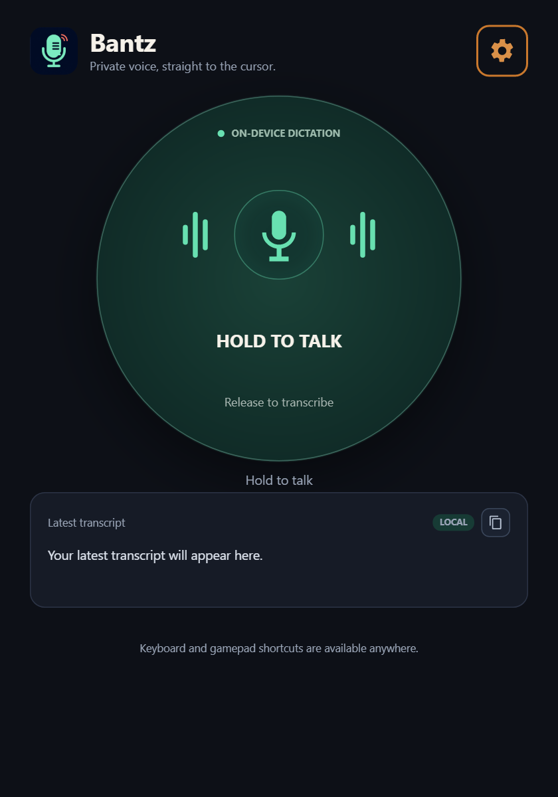
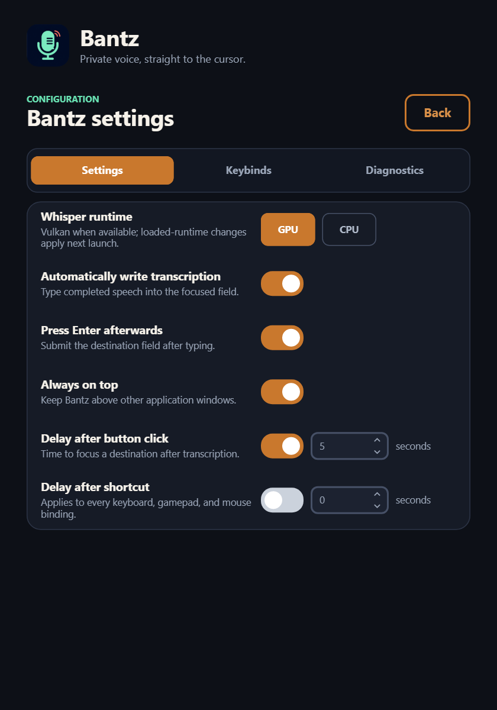

# Bantz

Bantz is a small, private hold-to-talk dictation app for Windows, with an experimental Linux x64 host. It records only while you hold its main button or a supported global hotkey, transcribes locally, and types the result into whichever text field you choose.

## Screenshots

**Main page**



**Settings page**



## How it works

- Hold the large button, speak, then release. Once transcription finishes, Bantz gives you a visible five-second countdown to click a destination field before it types.
- Cancel a pending countdown from its bottom bar. Pressing PTT again adds a 1.5-second safety buffer while preserving the pending transcript, so an earlier result can type while a new recording is underway.
- On Windows, hold a configured keyboard chord, XInput gamepad button, or mouse button anywhere outside Bantz, speak, then release. The default is `Ctrl+Shift+Space` and types immediately.
- Recordings shorter than 1.5 seconds are discarded as accidental presses and never sent to Whisper.
- On Windows, open **Settings** to add several keyboard, gamepad, or mouse inputs, remove them, undo the latest binding change, or restore the default. Mouse support includes left, right, wheel-click, Back, Forward, and modifier-plus-mouse chords.
- Under **Keybinds > Advanced**, use `Ctrl+T` (or assign another dedicated input) to enable or disable every hold-to-talk shortcut. PTT shortcuts start disabled because Bantz consumes assigned global inputs while listening for them; the toggle remains active so mouse-wheel, Back, Forward, and other temporary bindings can quickly be restored. Remove the toggle binding in Advanced to disable it too.
- Set button and shortcut delays independently from 0 to 10 seconds. Button delay starts enabled at five seconds; shortcut delay starts disabled at zero.
- Enable **Press Enter afterwards** to send Enter after the transcript.
- Enable **Compatibility mode (clipboard paste)** when a destination drops typed characters, as Remote Desktop sessions and some virtual-machine consoles do. Bantz then puts the transcript on the clipboard and sends Ctrl+V instead of synthesizing each character. On Windows every format the clipboard was holding is copied first and handed back a moment after the paste, so text, images, and copied files survive; colour palettes, owner-drawn formats, and anything over 32 MiB are dropped rather than copied. Copying something else during that moment is overwritten when the previous contents return.
- Enable **Always on top** to keep Bantz above other windows.
- Open **Input** to choose which microphone Bantz records from, or leave it on the system default. The list refreshes when the tab opens and from its **Refresh** button. Bantz remembers the device by name, so it finds the same microphone again after device numbers shift, and falls back to the system default while that device is disconnected.
- On Windows, closing the window keeps Bantz available in the notification area. Left-click its tray icon to restore it, or right-click and choose **Close Bantz** to exit.
- On first run, choose where all Bantz data lives: a per-user app-data folder, or a portable `BantzData` folder beside the executable.
- Then choose **GPU (Vulkan)** or **CPU only**. Bantz downloads only the selected pinned Whisper.net runtime, verifies its SHA-256 hash, and extracts only the native files for the current platform. The choice remains editable in Settings; changing to a runtime that is not installed returns to setup on the next launch.
- If Bantz itself still has focus when the button countdown ends, it keeps the transcript visible instead of typing into itself.

Whisper is a speech-recognition model that turns recorded audio into text. Audio is processed locally. First-run setup asks before downloading the 142 MiB English Whisper `base.en` model and shows progress. Settings, storage metadata, models, and downloaded runtimes stay together under the selected data root. On Windows, per-user mode uses `%LocalAppData%\Bantz`; portable mode uses `BantzData` beside the executable. On Linux, per-user mode uses `$XDG_DATA_HOME/bantz` when set and otherwise the platform local-data directory, typically `~/.local/share/Bantz`; portable mode uses `BantzData` beside the executable. Subsequent dictation works offline. The model is not embedded in the executable or stored in this repository.

## Run from source

Common source requirements:

- .NET 10 SDK `10.0.300` or a compatible patch
- A GitHub personal access token with `read:packages` for the public CupriFace package feed
- A working default recording device
- An x64 CPU with AVX, AVX2, FMA, and F16C support for the CPU runtime

Windows also requires:

- Windows 11 x64
- The Microsoft Visual C++ 2022 x64 runtime required by the native Whisper runtime

GitHub requires authentication for its NuGet feed even though CupriFace is public. Register the
feed credentials once in your user-level NuGet configuration; the repository's `NuGet.config`
names the source but deliberately holds no credentials, so never add a token to it or commit one.

```powershell
dotnet nuget add source https://nuget.pkg.github.com/Wixely/index.json `
  --name GitHub-Wixely-Packages `
  --username 'your-github-username' `
  --password 'your-read-packages-token' `
  --configfile "$env:APPDATA\NuGet\NuGet.Config"
```

The source name must be `GitHub-Wixely-Packages`, because NuGet matches stored credentials to a
source by name. Restore then works from any shell, including the VS Code build task:

```powershell
dotnet run --project src/Bantz.Windows
```

Use a model already on disk instead of the first-run download:

```powershell
dotnet run --project src/Bantz.Windows -- --model C:\models\ggml-base.en.bin
```

The `BANTZ_STT_MODEL` environment variable provides the same override. Command-line configuration wins.
Only one interactive Bantz instance runs by default. Pass `--allow-multiple-instances` to start an
additional instance, for example when testing two configurations side by side.

The Linux x64 host is experimental. It supports the main hold-to-talk button, local transcription, text insertion, delays, Enter-afterwards, and always-on-top. It requires `glibc` 2.31 or newer and `libstdc++6`. Install `alsa-utils` for recording and either `wtype` (Wayland) or `xdotool` (X11) for text insertion. Compatibility mode additionally needs `wl-copy` and `wl-paste` (Wayland) or `xclip` (X11). Linux keeps one clipboard type rather than all of them, because those tools own the selection for a single type per invocation; text is preserved when the clipboard offers it, otherwise the first type it advertises. Then run:

```bash
dotnet nuget add source https://nuget.pkg.github.com/Wixely/index.json \
  --name GitHub-Wixely-Packages \
  --username 'your-github-username' \
  --password 'your-read-packages-token' \
  --store-password-in-clear-text \
  --configfile "$HOME/.nuget/NuGet/NuGet.Config"
dotnet run --project src/Bantz.Linux
```

Linux needs `--store-password-in-clear-text` because NuGet cannot encrypt stored passwords there.

Global keyboard, gamepad, and mouse bindings and window tray behaviour are currently Windows-only. The Vulkan runtime is also experimental on Linux; choose CPU for the compatibility path.

## Build and test

```powershell
./eng/Verify.ps1
```

Create the same standalone executables and archives used by CI:

```powershell
./eng/Package.ps1 -Platform windows-x64
./eng/Package.ps1 -Platform linux-x64 # run on Linux so its smoke test can execute
```

Build the reusable libraries and prove package-only consumption:

```powershell
./eng/PackLibraries.ps1
```

This creates `Bantz.Speech.Abstractions`, `Bantz.Speech.Whisper`, `Bantz.Capture`, and
`Bantz.Input` packages plus symbols. The script then restores, builds, and runs
`samples/MinimalDictation` from the local packages rather than project references. Speech
contracts use signed 16-bit, 16 kHz, mono PCM. Minimum-duration and silence decisions remain
consumer workflow policy; generic tray creation/menu support is not part of the first input API.

Each GitHub release provides a direct standalone Windows `.exe` and Linux executable, plus archives containing the licence and third-party notices. The executable is self-contained and approximately 64 MiB; it does not require a separate .NET installation. Linux users may need to run `chmod +x` after downloading the direct executable.

Whisper native runtimes and speech models are downloaded separately during setup: about 18 MiB plus the model for CPU, or 35 MiB plus the model for Vulkan. Only the selected runtime's files for the current platform are installed.

Pull requests must pass formatting, restore/audit, build, tests, dependency review, both platform package smoke tests, and CodeQL. A tag matching the version in `Directory.Build.props` (for example `v0.1.0`) builds both standalone executables and archives, generates SHA-256 files, and publishes a GitHub prerelease with generated notes.

NativeAOT remains an opt-in probe (`-p:Aot=true`) because it requires the Visual Studio C++ linker and must still be qualified with the native CupriFace and Whisper runtimes. The supported release path above is self-contained and single-file without NativeAOT.

Generate a headless UI snapshot for visual review:

```powershell
dotnet run --project src/Bantz.Windows -- --snapshot artifacts\bantz-ui.png --snapshot-width 900 --snapshot-height 1300
dotnet run --project src/Bantz.Windows -- --page storage --snapshot artifacts\bantz-storage.png
dotnet run --project src/Bantz.Windows -- --page onboarding --snapshot artifacts\bantz-onboarding.png
dotnet run --project src/Bantz.Windows -- --page settings --snapshot artifacts\bantz-settings.png
dotnet run --project src/Bantz.Windows -- --page input --input-preview --snapshot artifacts\bantz-input.png
dotnet run --project src/Bantz.Windows -- --page keybinds --snapshot artifacts\bantz-keybinds.png
```

VS Code tasks and launch configuration are included. Open the repository and run **Bantz: debug**.

## Speech engine research

[FUTO Voice Input](https://github.com/futo-org/voice-input) is the product reference. Development has largely shifted to the voice input built into FUTO Keyboard, while the standalone app remains available. It performs private on-device recognition using OpenAI Whisper, whisper.cpp, and voice-activity detection. The application source uses the FUTO Source First License 1.0, so Bantz does not copy or derive from it.

The MVP instead uses [Whisper.net](https://github.com/sandrohanea/whisper.net) 1.9.1, an MIT-licensed .NET binding around the MIT-licensed [whisper.cpp](https://github.com/ggml-org/whisper.cpp). `ITranscriptionEngine` keeps this choice replaceable. Standard `base.en` is an initial compatibility choice, not a final quality decision.

FUTO does not need a medium or large Whisper model: Whisper also has smaller Tiny, Base, and Small families. FUTO's separate [whisper-acft](https://github.com/futo-org/whisper-acft) research is MIT-licensed and tunes those models to reduce latency and repetition when short recordings use a reduced audio context. Model quantization is a separate size optimization. Bantz currently downloads whisper.cpp's standard 142 MiB English Base model; evaluating an ACFT-compatible or quantized Base model is a future quality, latency, and size experiment.

## Current limits

- Linux support is experimental and currently lacks global keyboard/gamepad/mouse bindings and tray behaviour. Audio capture depends on `arecord`, while text insertion depends on `wtype` or `xdotool`.
- XInput-compatible gamepads are supported. Other controller APIs are not yet mapped.
- Windows prevents a normal process from injecting into an elevated destination. Run both applications at the same integrity level.
- The default model recognises English. Supply another compatible GGML model when evaluating multilingual recognition; the current adapter still requests English and will need a language option before that becomes a supported flow.

## License

Bantz is licensed under the [MIT License](LICENSE). Third-party dependencies retain their own licenses; see [THIRD-PARTY-NOTICES.md](THIRD-PARTY-NOTICES.md).
